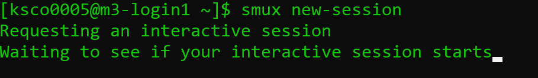

<!---
prerequistites: what is a cluster, how do you access,
what resources ar eon the cluster, CLI skills.
HPC: 2/5
ML: 1
motivations: I want compute to do stuff!!!
--->

## Login and Compute Nodes
You have learnt tools to navigate the resources available
to you on the cluster, but we haven't shown you how to 
access those resources yet. In fact, if you look at the 
command prompt that you're logged into to HPC on, it will
say something like [username@m3-login1]. When you login to the cluster, 
rather than putting you on a random node with random 
resources, you're directed to what's called a login node. 
The other nodes which you have seen by using tools like
`sinfo` and `show_cluster`, are referred to as compute nodes.

In general, clusters will have login nodes available. 
It is important to know the login node is shared between
all users who have just logged in, so it should be reserved
for lightweight tasks like opening and editing files,
navigating around the system, submitting jobs, or other
non-computationally intensive tasks. If you run big tasks
on the login node, it will impact other users negatively. 
This means that before you can do computationally 
intensive work like running resnet, you should ask for 
compute node resources, which we will cover shortly. Remember,
the scheduler ensures compute resource access is fair.

> ## When can you use the login node?
>
> Which of the following tasks could be done on the login node?
> 1. Training a neural network
> 2. Downloading a dataset
> 3. Using git to pull a repository
> 4. Editing a script
>
> {: .source}
>
> > ## Solution
> >
> > 1. Training a neural network is computationally intensive,
> >    and may impact other users - don't do this on the login nodes. 
> > 2. Downloading a dataset should also be done on a compute
> >    node, or M3 has a special node for large data downloads
> >    at `m3-dtn.massive.org.au`.
> > 3. A git pull can generally be done safely on the login
> >    node, but if it's particularly large and takes a long
> >    longer than 15 minutes, consider moving to a compute node instead.
> > 4. Editing a script is lightweight enough that doing this
> >    won't impact other users. You can do this on the login node.
> >
> > In general, if you're not sure if something is too
> > heavy for the login node, request a compute node to run on.
> > {: .output}
> {: .solution}
{: .challenge}

## Requesting compute resources on the command line
Here, we assume you have ssh'd into M3 using a terminal,
or are running a terminal on the login node with Strudel2. 
While GUI interfaces exist for accessing HPC, traditionally
HPC access is provided via the command line, and using Linux. 
It's important to understand how to request resources 
on the command line,
and how to query the HPC for your requests.

You will remember from earlier than the cluster is shared 
among many users, and so there is a scheduler, and queue. 
*Jobs* refer to tasks for the HPC that wait in the queue, 
including resource requests - you can think of each resource
request as a *job*. The way the queue is ordered and the amount
of time you will wait in the queue is a 
complicated topic that we will discuss later, but for now
you can think of the queue as a method for the 
scheduler to manage supply and demand.

In general, there are two ways to request resources on the 
command line:
1. Interactively: You request access to a compute node where you can type in commands 
   in real time, the same way you would on your local workstation.
   You may have to wait in the queue to access a compute node interactively.

2. Job submission: You write a list of instructions and 
   send them off the queue in a job submission script, which are
   executed without you actively typing in commands. You may have
   to wait in the queue for your job to start executing, but it
   will execute automatically when resources are available.

There is an additional way to access compute resources on MASSIVE with 
the Strudel interface, which we will cover later. 

## Interactive jobs (srun and smux)
Interactive sessions allow you to connect to a compute node and work on 
that node directly. This allows you to develop how your jobs might run
 (i.e. test that commands run as expected before putting them in a 
script) and do heavy development tasks that cannot be done on the login 
nodes (i.e. use many cores). Despite being interactive, you may need to
queue to gain access to a session. You can find documentation for
[running interactive jobs on MASSIVE on our docs website](https://docs.massive.org.au/M3/slurm/interactive-jobs.html?highlight=smux).

On a general cluster with a SLURM scheduler, you would use the command
`srun` to request resources for an interactive job. On MASSIVE, we have a command
called `smux`, which combines `srun` with `tmux`. The command line tool 
`tmux` allows you to reconnect to running sessions, split your terminal
pane so you can do work side by side, and otherwise improve your command
line experience. By combining the two to create `smux`, you have the ability
to connect and reconnect to interactive sessions as they run - for example,
if your internet drops out while you're running an interactive job, this allows
you to reconnect to your interactive session rather than requesting a new one.

In general, the command to start a new interactive job on MASSIVE is 

`smux new-session`

This will request an interactive job with default resources of 1 CPU, 
4G of memory, and 2 hours of walltime. 

This request will be added the queue, 
and when the resources are available, the job will schedule and you'll have access
to a compute node.If you run this command, you will
notice your terminal changes and gains a bar down the bottom letting you know
which node you're running on. It will look like this:

IMAGE HERE

This means I'm running on a compute node! 

I can leave this running in the background if I like and exit it by typing
in `Ctrl+b+d`.

I can then reconnect to it while there is remaining walltime by running
smux list-sessions, and then smux attach-session [num]. If I type `exit` or `Ctrl d`,
I'll leave my session and it will be cancelled.If you run `smux list-sessions`
following this, you'll see your session has ended.

There are some parameters you can change in your smux command if you 
need something different than the defaults. For example, you can run

`smux new-session --time=03:00:00`

To update the time from 2 hours to 3 hours. You can see the other parameters 
you're able to change by running smux -h or smux --help, such as ntasks 
(number of CPUs), memory (amount of RAM), or partition (for specific
partitions with certain resources available). 

> ## Getting started with smux
>
> Start an smux session with 1 hour walltime and 4 CPUs on the 
> `comp` partition.
> 
> Hint: running smux n --help may help you if you get stuck.
>
> {: .source}
>
> > ## Solution
> >
> > You would run the command:
> > 
> > ~~~
> > smux new-session --time=01:00:00 --ntasks=4 --partition=comp
> > ~~~
> > Remember, time assigns time in the format DD-HH:MM:SS, ntasks refers
> > to the number of cpus, and partition tells smux which partition
> > to submit the job to. 
> > {: .output}
> {: .solution}
{: .challenge}

If you only ask for a small amount of available resources like the default
smux new-session command does, you'll likely not wait at all for your
session to begin. However, if you ask for more than that, you may need 
to wait for your job before you can connect. Every time you request resources 
on the HPC you create a job that waits in the queue, and that job
has an associated job ID. SLURM has a variety of tools for interacting 
with the jobs you're running that work across interactive jobs, jobs 
submitted to the cluster with sbatch, and jobs ran with other tools
such as Strudel Desktops. 

For example, you could type in:

`smux new-session --ntasks=4 --memory=4G --time=24:00:00 --gres=gpu:2`

The --gres=gpu:2 portion of the command specifies that we need 2 GPUs.
Now we're asking for many more resources and a resource that's in high
demand with the gres command: a node with a GPU. 
As a result, our interactive job won't start immediately, and we'll be placed in the queue. 
THIS LOOKS LIKE?
Here, we can use the smux list-sessions command again to see what's
going with our interactive job. Other SLURM tools we can use to investigate
our job include:

`squeue -j <job-id>`
`squeue -u <username>`
`squeue --start`
`show_job`
`scancel`

> ## Job profiling with interactive jobs
>
> One of the reasons you use interactive jobs is to see what resources
> you will need before moving to job submission.
> For this exercise, you should:
> 1. Reconnect to your smux session from before if you disconnected.
> 2. Time how long it takes to run the following bash script:
>    ./thiscourse/bashscript.sh
> 3. Once you've recorded the time somewhere, cancel your smux interactive job. 
> 4. Try typing in the command 
> ~~~
> sacct -j <job-id> --format=JobID,Jobname,partition,state,time,start,end,elapsed,MaxRss,MaxVMSize,nnodes,ncpus,nodelist`
> ~~~   
> what do you think the output is useful for?
>
> {: .source}
>
> > 
> > ## Solution                                                         
> >                                                                     
> > You would run the command:
> > 1. To reconnect, you'll use 
> >    `smux attach-session <job-id>`
> >    If you've loot your job ID, you can find it by running
> >    `smux list-sessions`, or `squeue -u <username>`. 
> >    and if you already deleted your session, you can start a new one.
> > 2. You will run the command `time ./bash.bash` It should take around [blah]. 
> > 3. You can cancel your smux session by typing `exit`, or by running
> >    scancel <job-id>.
> > 4. The `sacct` command, called s-account, can give you information
> >    about the jobs you have run, similar to `show_job`. It's a useful
> >    tool for profiling the resources your job has used, with many options
> >    to select from including the ones shown here. You can learn more in
> >    [the SLURM documentation.](https://slurm.schedmd.com/sacct.html)
> >
> > {: .output}
> {: .solution}
{: .challenge}

Congratulations - you can now ask for HPC resources interactively! Note,
if you're ever using a HPC without smux that has the traditional SLURM
`srun` available, the commands look very similar. For example:

`srun --time=01:00:00 --ntasks=4 --partition=comp`

You just won't be able to disconnect and reconnect from the session as it runs.
You can always learn more about srun if needed by going to the
[SLURM documentation website](https://slurm.schedmd.com/srun.html). 

## Job submission scripts (sbatch)
To get access to the largest amount of compute time you 
need to submit non-interactive jobs. You might want to submit 
a job when: 

- You need a large amount of compute resources. As we have 
  seen, when you request more resources or resources in high
  demand, you have to wait in the queue. A job is no longer
  very interactive if you have to wait hours for it to start!

- You have tested your code and know what resources you need,
  and want to write a job submission script for reproducibility.

- You have tested your code and have the commands
  well defined now. There's no point waiting around 
  at your computer to type in commands when a job 
  submission script will execute them for you when 
  resources are available.

Overall, the benefit of submitting jobs versus running 
interactive jobs is that when the resources become 
available to you, the job will execute the commands you 
wrote immediately. If you have an interactive job, commands 
are only executed when you input them, leading to wasted
 time on your behalf waiting for the session to become 
available and wasted resources (compute time) that could 
be used by others in their research. It is important to 
use interactive jobs as the precursor to job submissions 
to get the benefits of both.

Let's have a look at a basic sbatch script - you'll
notice some of the commands look very similar to what you
needed to run for your interactive smux job. 

~~~
\#!/bin/bash
\#SBATCH --job-name=MyJob
\#SBATCH --mail-user=youremail@domain.com
\#SBATCH --mail-type=BEGIN,END,FAIL
\#SBATCH --account=nq46
\#SBATCH --time=01:00:00
\#SBATCH --ntasks=1
\#SBATCH --gres=gpu:2
\#SBATCH --partition=m3g
\#SBATCH --mem=4G

./mycode.sh
~~~

> ## Getting started with sbatch
>
> Using the knowledge you already have,
> take a guess at what each #SBATCH command 
> in the example script does. 
> 
> {: .source}
>
> > ## Solution
> > Some of these you will know from our interactive examples before!
> >
> > - `--job-name=MyJob` gives your job a name, and isn't 
> >   necessary to get your job running. 
> > - `--mail-user=youremail@domain.com` and `mail-type=BEGIN,END,FAIL`
> >   indicates to SLURM you want to be emailed when your job begins, ends,
> >   or fails. This isn't necessary to get your job running.
> > - `--account=nq46` indicates what your project ID is. 
> > - `--time=01:00:00` indicates the walltime
> >   of your job, 1 hour in this case.
> > - `--ntasks=1` indicates the amount of CPUs you need, 1 in this case.
> > - `--gres=gpu:2` indicates the amount of GPUs you need, 2 in this case.
> > - `--partition=m3g` indicates the partition with the resources you need.
> >   In this case I know I want V100 GPUs, so I request the m3g partition.
> > - `--mem=4G` indicates the amount of memory you need, 4G in this case.
> > - `./mycode.sh` is the actual code you want to run! Anything you would
> >   usually run on the command line goes here. 
> > 
> > {: .output}
> {: .solution}
{: .challenge}

To run this script on the command line, you would type in:

~~~
sbatch myjob.sh
~~~

Once you do this, the scheduler adds your job to the queue, and waits
for the resources you've requested to become available. Once they are 
available, the script will run. You can use the same SLURM commands
we learned earlier to investigate the status of your job while it waits
in the queue and is running. 

When your job is running, SLURM will also produce two output files, 
typically called 

> ## Submitting a job to the cluster
>
> In the exercises "Getting started with smux" and 
> "Job profiling with interactive jobs" you started 
> an interactive job and ran a piece of bash code.
> Run that job again, except this time to submit it
> to the cluster with a job submission script.
> You will need to create a script to do this using
> #SBATCH directives instead of smux, and submit it to
> the cluster with the sbatch command. Remember the time you 
> noted down earlier for running the script!
> Don't worry if this takes a few attempts to get right!
> Remember, you can use the `squeue` and `show_job`
> commands to see if your job is running. 
> You can also see how your job is running by checking the SLURM
> output files.
> Once the job is done, you can investigate the resources used
> using the `sacct` command.
>
> {: .source}
>
> > ## Solution
> > smux new-session --time=01:00:00 --ntasks=4 --partition=comp
> > The job submission script you create might look like:
> >
> > ~~~
> > #!/bin/bash
> > #SBATCH --time=00:10:00
> > #SBATCH --ntasks=4
> > #SBATCH --partition=comp
> > #SBATCH --account=<projectid>
> > 
> > ./blah
> > ~~~
> > You would then need to use the command,
> > `sbatch myscript.sh` to submit the job, with whatever
> > name you used to create the script. 
> > {: .output}
> {: .solution}
{: .challenge}

Congratulations - you can submit jobs to the cluster! We have
covered quite a lot of content in this section, so don't be 
alarmed if it takes a while to sink in. It takes a bit
of practice to get used to the HPC environment and submitting
jobs, both with smux and submission scripts. Remember, if you're
ever unsure, you can always check the SLURM documentation site
that's been linked throughout this lesson, or send an
email to help@massive.org.au.
