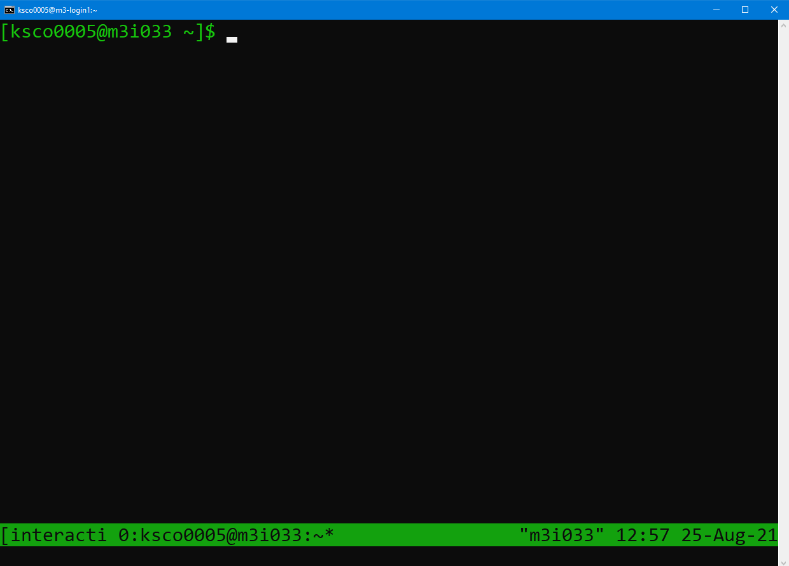
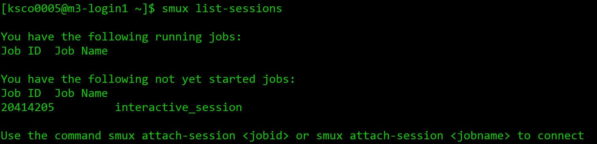
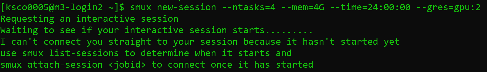
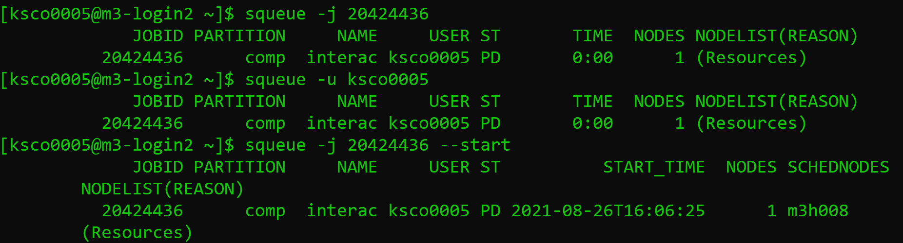

<!---
prerequistites: what is a cluster, how do you access,
what resources ar eon the cluster, CLI skills.
HPC: 2/5
ML: 1
motivations: I want compute to do stuff!!!
--->

## Login and Compute Nodes
You can see the resources on the cluster now,
but we still haven't shown you how to access them.
When you login to the cluster, you'll notice the command line
will say something like `[m3username@m3-login1 ~]`. 
This is telling where you are, which is on a login node.
When you first login to the cluster, 
rather than putting you on a random node with random 
resources, you're directed to a login node. 
The other nodes which you have seen by using tools like
`sinfo` and `show_cluster`, are referred to as compute nodes.

In general, clusters will have a few login nodes available
that everyone will be assigned to when they log on. 
It is important to know that because the login node is shared between
all users who have just logged in, it should be reserved
for lightweight tasks like 
- Opening and editing files
- Navigating around the system
- Submitting jobs
- Investigating the cluster (`show_cluster`, `sinfo`, etc.)
- Tasks which aren't computationally intensive.

If you run intensive tasks on the login node, it will impact other users negatively,
and you may even get a friendly email from the HPC admins asking if 
you need any help getting onto a compute node.
This means that before you can do computationally 
intensive work like running ResNet, you need to request 
compute node resources. 

> ## When can you use the login node?
>
> Which of the following tasks could be done on the login node?
> 1. Training a neural network
> 2. Downloading a dataset
> 3. Using git to pull a repository
> 4. Editing a script
>
> {: .source}
>
> > ## Solution
> >
> > 1. Training a neural network is computationally intensive,
> >    and may impact other users - don't do this on the login nodes. 
> > 2. Downloading a dataset should also be done on a compute
> >    node, or M3 has a special node for large data downloads
> >    at `m3-dtn.massive.org.au`.
> > 3. A git pull can generally be done safely on the login
> >    node, but if it's particularly large and takes a long
> >    longer than 15 minutes, consider moving to a compute node instead.
> > 4. Editing a script is lightweight enough that doing this
> >    won't impact other users. You can do this on the login node.
> >
> > In general, if you're not sure if something is too
> > heavy for the login node, request a compute node to run on.
> > {: .output}
> {: .solution}
{: .challenge}

## Requesting compute resources on the command line
Here, we assume you have ssh'd into M3 using a terminal,
or are running a terminal on the login node with Strudel2. 
While GUI interfaces exist for accessing HPC, traditionally
HPC access is provided via the Linux command line.
It's important to understand how to request resources 
on the command line,
and how to query the HPC about your requests.

You will remember from earlier than the cluster is shared 
among many users, and so there is a scheduler which manages the queue. 
*Jobs* refer to tasks for the HPC which wait in the queue, 
including resource requests. The way the queue is ordered and the amount
of time you will wait in the queue is a 
complicated topic that we will discuss later, but for now
you can think of the queue as a method for the 
scheduler to manage supply and demand.

In general, there are two ways to request resources on the 
command line:
1. **Interactively:** You request access to a compute node where you can type in commands 
   in real time, the same way you would on your local workstation.
   You may have to wait in the queue to access a compute node interactively.

2. **Job submission:** You write a list of instructions (commands to execute) and 
   the resources you need for the commands in a *job submission script*.
   You then submit your request to the scheduler which will determine when your 
   job begins You may have to wait in the queue for your job to begin, but it
   will execute automatically when resources are available.

There is an additional way to access compute resources on MASSIVE with 
the Strudel interface, which we will cover later. 

## Interactive jobs (srun and smux)
Interactive sessions allow you to connect to a compute node and work on 
that node directly. This allows you to develop how your jobs might run
 (i.e. test that commands run as expected before putting them in a 
script) and do heavy development tasks that cannot be done on the login 
nodes (i.e. use many cores). Despite being interactive, you may need to
queue to gain access to a session. You can find documentation for
[running interactive jobs on MASSIVE on our docs website](https://docs.massive.org.au/M3/slurm/interactive-jobs.html?highlight=smux).

On a general cluster with a SLURM scheduler, you would use the command
`srun` to request resources for an interactive job. On MASSIVE, we have a command
called `smux`, which combines `srun` with `tmux`. The command line tool 
`tmux` allows you to reconnect to running sessions, split your terminal
pane so you can do work side by side, and otherwise improve your command
line experience. By combining the two to create `smux`, you have the ability
to connect and reconnect to interactive sessions as they run - for example,
if your internet drops out while you're running an interactive job, this allows
you to reconnect rather than requesting a new session.

In general, the command to start a new interactive job on MASSIVE is 

~~~
smux new-session`
~~~

This will request an interactive job with default resources of 1 CPU, 
4G of memory, and 2 hours of walltime. This request will be added the queue, 
and when the resources are available, the job will schedule and you'll have access
to a compute node. When your job starts, you will notice your terminal changes and looks like:

 

You will notice the command prompt has changed to say `username@m3i033`, 
which indicates which compute node I have attached to. The bar down the 
bottom of the screen indicates I am currently running a tmux session 
connected to `m3i033`, as well as the date and time. The name of my job,
"interactive", also appears in the bottom left hand side. 

The power of running `smux` is that you can disconnect and reconnect to this
session with compute node access while the job is running. To detach from the 
session without cancelling my job, type in <kbd>Ctrl</kbd>+<kbd>B</kbd>, release the keys, 
and then press the <kbd>d</kbd> key. 

To see what sessions I have running, I can use the `smux list-sessions` command,
and it will output a list of my currently running jobs, as well as any that are 
still waiting in the queue. 

This includes the job name, and the job ID number assigned 
by the SLURM scheduler. We will explore the purpose of the job ID number in more depth shortly. 
To reconnect to a running session, use the `smux attach-session <number>` command
which will take us back to our session. Any processes which were running when we left the 
session will have continued to run. 

If you wish to leave the running session, and cancel it, you can type `exit` or 
use <kbd>Ctrl</kbd>+<kbd>D</kbd>. If you run `smux list-sessions`
following this, you'll see your session is no longer listed, and you will
need to request resources again next time you need them.

There are some parameters you can change in your smux command if you 
need different resources than the defaults. For example, you can run:

~~~
smux new-session --time=03:00:00
~~~

This will update the time of your session from 2 hours to 3 hours. 
You can see the other parameters you're able to change by running:

~~~
smux -n --help 

usage: smux new-session [-h] [--ntasks <n>] [--nodes <n>] [--mem <n>]
                        [--cpuspertask <n>] [--qos <n>] [-J <n>] [-A <n>]
                        [-p PARTITION] [-r RESERVATION] [-t TIME] [--gres <n>]
                        [-o <n>] [-e <n>]

optional arguments:
  -h, --help            show this help message and exit
  --ntasks <n>          The number of tasks you will launch
  --nodes <n>           The number of nodes you need
  --mem <n>             The amount of memory you need
  --cpuspertask <n>     The number of cpus needed for each task
  --qos <n>             The QoS (Quality of Service) used for the task
                        (certain QoS are only valid on some partitiotns)  -J <n>, --jobname <n>
                        The name of your job
  -A <n>, --account <n>
                        Specify your account
  -p PARTITION, --partition PARTITION
                        The partition to execute on
  -r RESERVATION, --reservation RESERVATION
                        The reservation to use
  -t TIME, --time TIME  The amount of time to run for
  --gres <n>            The type and number of gpus needed for each task  -o <n>, --output <n>  Standard output file name
  -e <n>, --error <n>   Error output file name
~~~

As you can see, you're able to change a variety of paramaters 
for your resource request, inclusing ntasks 
(number of CPUs), mem (amount of RAM), or partition (for specific
partitions with certain resources available). 

> ## Getting started with smux
>
> Start an smux session with 1 hour walltime and 4 CPUs on the 
> `comp` partition.
> 
> Hint: running `smux n --help` may help if you get stuck.
>
> {: .source}
>
> > ## Solution
> >
> > You would run the command:
> > 
> > ~~~
> > smux new-session --time=01:00:00 --ntasks=4 --partition=comp
> > ~~~
> > Remember, time assigns time in the format DD-HH:MM:SS, ntasks refers
> > to the number of cpus, and partition tells the scheduler which partition
> > to submit the job to. 
> > {: .output}
> {: .solution}
{: .challenge}

If you only ask for a small amount of available resources like the default
`smux new-session` command does, you'll likely only wait a few seconds for your
session to begin. However, if you ask for more resources, you may need 
to wait for your job to start before you can connect. 
Every time you request resources on the HPC you create a job that waits 
in the queue, and that job has an associated job ID as we saw earlier. 
SLURM has a variety of tools for interacting with jobs you have submitted,
and jobs that you're running. These tools will work with other methods
for requesting resources such as job submission with sbatch, and jobs 
submitted with other tools such as Strudel Desktops. Let's explore these
tools with an interactive `smux` job. 

For example, consider the following command:

~~~
smux new-session --ntasks=4 --mem=4G --time=24:00:00 --gres=gpu:2
~~~

The `--gres=gpu:2` portion of the command specifies that we need two GPUs.
GPUs are specialised resources that are in high demand, and we are requesting 
two - this will make it more difficult for the scheduler to find available
resources. This is an example of an interactive job that won't start immediately,
and our job will wait in the queue for a while.

Here, we can use the `smux list-sessions` command again to see what's
going with our interactive job. Other SLURM tools we can use to investigate
our job include:

~~~
# To see every job waiting in the queue
squeue
# To investigate specific jobs waiting in the queue
squeue -j <job-id>
# To investigate all jobs a user has the queue
squeue -u <username>
# To find the predicted start time of a job
# Usually combined with the -j or -u options
squeue --start
# A tool built for MASSIVE to list details of jobs running or in the queue
show_job
# To cancel a submitted or running job
scancel
~~~

You can find your job ID by running `smux list-sessions`, and then try the above commands
on your waiting job. The final `scancel` command will cancel the job.

The squeue command will output information about your job, including the Job ID,
the partition the job is submitted to, the name of the job, the user
running the job, the state it's in, how long it has been running, how many nodes 
you have requested, and why the job hasn't started yet. Im particular, a state of
`PD` means pending, and the job submitted above is waiting due to `Resources`.
This reflects our request for two GPUs which currently aren't available. You can also 
see the `--start` option has predicted my job start time as 4pm on the 26th of August.
The output of the `show_job` command is quite lengthy, so I recommend you run this 
in your own terminal. 

> ## Job profiling with interactive jobs
>
> One of the reasons to use interactive jobs is to see what resources
> you will need before moving to job submission. One way to measure the 
> the resources used by a job is with the `sacct` command, which we will explore.
>
> For this exercise, you should:
> 1. Reconnect to your smux session from before if you disconnected, or start another job.
> 2. Time how long it takes to run the following bash script:
>    ./thiscourse/bashscript.sh
> 3. Once you've recorded the time somewhere, cancel your smux interactive job. 
> 4. Try typing in the command 
> ~~~
> sacct -j <job-id> --format=JobID,Jobname,partition,state,time,start,end,elapsed,MaxRss,MaxVMSize,nnodes,ncpus,nodelist`
> ~~~   
> What do you think the output is useful for?
>
> {: .source}
>
> > 
> > ## Solution                                                         
> >                                                                     
> > 1. To reconnect, you'll use 
> >    `smux attach-session <job-id>`
> >    If you've lost your job ID, you can find it by running
> >    `smux list-sessions`, or `squeue -u <username>`. 
> >    and if you already deleted your session, you can start a new one.
> > 2. You will run the command `time ./bash.bash` It should take around [blah]. 
> > 3. You can cancel your smux session by typing `exit`, or by running
> >    scancel <job-id>.
> > 4. The `sacct` command, called s-account, can give you information
> >    about the jobs you have run, similar to `show_job`. It's a useful
> >    tool for profiling the resources your job has used, with many options
> >    to select from including the ones shown here. You can learn more in
> >    [the SLURM documentation.](https://slurm.schedmd.com/sacct.html)
> >
> > {: .output}
> {: .solution}
{: .challenge}

Congratulations - you can now ask for HPC resources interactively! Note,
if you're using a different HPC than MASSIVE you won't have smux, and will use
`srun` instead. The commands look very similar. For example:

~~~
srun --time=01:00:00 --ntasks=4 --partition=comp
~~~

You won't be able to disconnect and reconnect from the session as it runs.
You can always learn more about `srun` if needed by going to the
[SLURM documentation website](https://slurm.schedmd.com/srun.html). 

## Job submission scripts (sbatch)
To get access to the largest amount of compute time you 
need to submit non-interactive jobs. You might want to submit 
a job when: 

- You need a large amount of compute resources. As we have 
  seen, when you request more resources or resources in high
  demand, you have to wait in the queue. A job is no longer
  very interactive if you have to wait hours for it to start!

- You have tested your code and know what resources you need,
  and want to write a job submission script for reproducibility.

- You have tested your code and have the commands
  well defined now. There's no point waiting around 
  at your computer to type in commands when a job 
  submission script will execute them for you when 
  resources are available.

Overall, the benefit of submitting jobs versus running 
interactive jobs is that when the resources become 
available to you, the job will execute the commands you 
wrote immediately. If you have an interactive job, commands 
are only executed when you input them, leading to wasted
 time on your behalf waiting for the session to become 
available and wasted resources (compute time) that could 
be used by others in their research. It is important to 
use interactive jobs as the precursor to job submissions 
to get the benefits of both.

Let's have a look at a basic sbatch script - you'll
notice some of the commands look very similar to what you
needed to run for your interactive smux job. 

~~~
\#!/bin/bash
\#SBATCH --job-name=MyJob
\#SBATCH --mail-user=youremail@domain.com
\#SBATCH --mail-type=BEGIN,END,FAIL
\#SBATCH --account=nq46
\#SBATCH --time=01:00:00
\#SBATCH --ntasks=1
\#SBATCH --gres=gpu:2
\#SBATCH --partition=m3g
\#SBATCH --mem=4G

./mycode.sh
~~~

> ## Getting started with sbatch
>
> Using the knowledge you already have,
> take a guess at what each #SBATCH command 
> in the example script does. 
> 
> {: .source}
>
> > ## Solution
> > Some of these you will know from our interactive examples before!
> >
> > - `--job-name=MyJob` gives your job a name, and isn't 
> >   necessary to get your job running. 
> > - `--mail-user=youremail@domain.com` and `mail-type=BEGIN,END,FAIL`
> >   indicates to SLURM you want to be emailed when your job begins, ends,
> >   or fails. This isn't necessary to get your job running.
> > - `--account=nq46` indicates what your project ID is. 
> > - `--time=01:00:00` indicates the walltime
> >   of your job, 1 hour in this case.
> > - `--ntasks=1` indicates the amount of CPUs you need, 1 in this case.
> > - `--gres=gpu:2` indicates the amount of GPUs you need, 2 in this case.
> > - `--partition=m3g` indicates the partition with the resources you need.
> >   In this case I know I want V100 GPUs, so I request the m3g partition.
> > - `--mem=4G` indicates the amount of memory you need, 4G in this case.
> > - `./mycode.sh` is the actual code you want to run! Anything you would
> >   usually run on the command line goes here. 
> > 
> > {: .output}
> {: .solution}
{: .challenge}

To run this script on the command line, you would type in:

~~~
sbatch myjob.sh
~~~

Once you do this, the scheduler adds your job to the queue, and waits
for the resources you've requested to become available. Once they are 
available, the script will run. You can use the same SLURM commands
we learned earlier to investigate the status of your job while it waits
in the queue and is running. 

When your job is running, SLURM will also produce two output files, 
typically called 

> ## Submitting a job to the cluster
>
> In the exercises "Getting started with smux" and 
> "Job profiling with interactive jobs" you started 
> an interactive job and ran a piece of bash code.
> Run that job again, except this time to submit it
> to the cluster with a job submission script.
> You will need to create a script to do this using
> #SBATCH directives instead of smux, and submit it to
> the cluster with the sbatch command. Remember the time you 
> noted down earlier for running the script!
> Don't worry if this takes a few attempts to get right!
> Remember, you can use the `squeue` and `show_job`
> commands to see if your job is running. 
> You can also see how your job is running by checking the SLURM
> output files.
> Once the job is done, you can investigate the resources used
> using the `sacct` command.
>
> {: .source}
>
> > ## Solution
> > smux new-session --time=01:00:00 --ntasks=4 --partition=comp
> > The job submission script you create might look like:
> >
> > ~~~
> > #!/bin/bash
> > #SBATCH --time=00:10:00
> > #SBATCH --ntasks=4
> > #SBATCH --partition=comp
> > #SBATCH --account=<projectid>
> > 
> > ./blah
> > ~~~
> > You would then need to use the command,
> > `sbatch myscript.sh` to submit the job, with whatever
> > name you used to create the script. 
> > {: .output}
> {: .solution}
{: .challenge}

Congratulations - you can submit jobs to the cluster! We have
covered quite a lot of content in this section, so don't be 
alarmed if it takes a while to sink in. It takes a bit
of practice to get used to the HPC environment and submitting
jobs, both with smux and submission scripts. Remember, if you're
ever unsure, you can always check the SLURM documentation site
that's been linked throughout this lesson, or send an
email to help@massive.org.au.
